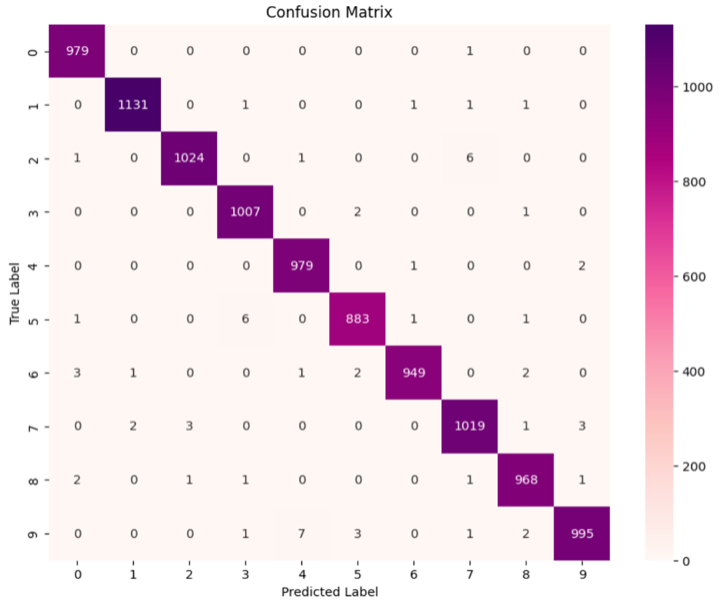
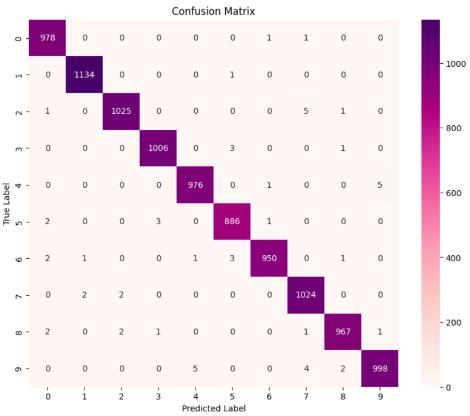
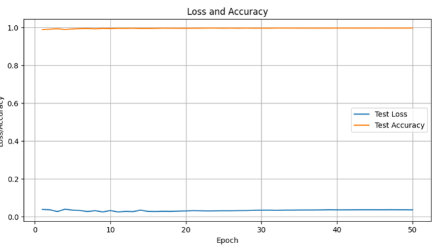
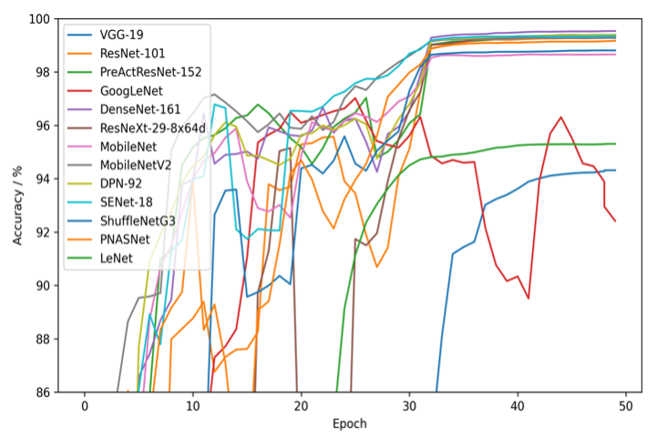
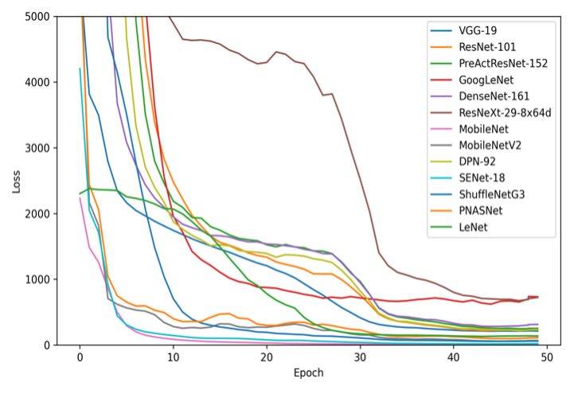

# Assignment2
# MNIST-baselines
This repository trained and tested a simple CNN model on the * MNIST* dataset 
and proposed our own method to improve the performance or reduce the model size.
Additionally, it contains various state-of-the-art (SOTA) models for comparison.

## Requirements
- [NumPy](http://www.numpy.org/)
- [scikit-learn](http://scikit-learn.org/stable/index.html)
- [PyTorch](http://pytorch.org/)

## Usage
### Create a model
1. Prepare `Model_Name.json` in [`config/`](./config)
2. Prepare `Model_Name.py` in [`models/`](./models)
3. Prepare `Trainer_Name.py` in [`trainers/`](./trainers) (optional) 
### Train a SOTA model
`python3 main.py --method Model_Name`
### Test a SOTA model
`python3 main.py --method Model_Name --test`
### Trained models
Available at [https://drive.google.com/drive/folders/1wQsRPMfqlsgEfL9VvEONtKhX-CMyKW4q?usp=share_link](https://drive.google.com/drive/folders/1wQsRPMfqlsgEfL9VvEONtKhX-CMyKW4q?usp=share_link)

### baseline

### DOnet

### DDOnet

### Pruning-DDOnet

### SOTA models

